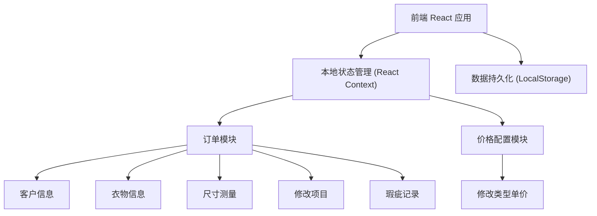
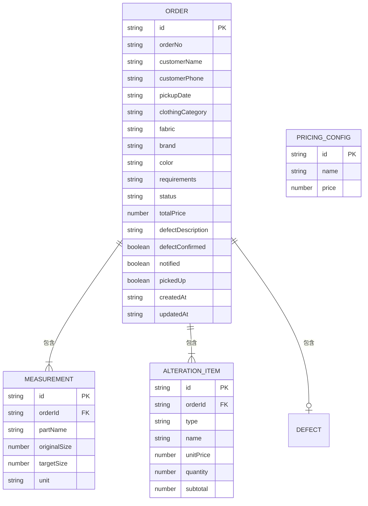

## 1. 架构设计



## 2. 技术描述
- 前端：React@18 + tailwindcss@3 + vite
- 初始化工具：vite-init
- 后端：无（纯前端 SPA，LocalStorage 持久化）
- 数据库：LocalStorage 存储 JSON 数据，含 Mock 初始数据
- UI 组件库：自定义组件（Tailwind 构建）
- 图标：lucide-react

## 3. 路由定义
| 路由 | 用途 |
|------|------|
| / | 订单列表页（首页） |
| /orders/new | 新建订单页 |
| /orders/:id | 订单详情/编辑页 |
| /pickup | 待取件列表 |
| /pricing | 价格配置页 |

## 4. 数据模型

### 4.1 数据模型定义



### 4.2 数据结构定义

**订单 (Order)**
```typescript
type OrderStatus = 'pending' | 'in_progress' | 'ready' | 'completed';

interface Order {
  id: string;
  orderNo: string;
  customerName: string;
  customerPhone: string;
  pickupDate: string;
  clothingCategory: string;
  fabric: string;
  brand: string;
  color: string;
  requirements: string;
  status: OrderStatus;
  totalPrice: number;
  measurements: Measurement[];
  alterationItems: AlterationItem[];
  defectDescription: string;
  defectConfirmed: boolean;
  notified: boolean;
  pickedUp: boolean;
  pickedUpAt?: string;
  createdAt: string;
  updatedAt: string;
}
```

**测量数据 (Measurement)**
```typescript
interface Measurement {
  id: string;
  partName: string;
  originalSize: number;
  targetSize: number;
  unit: string;
}
```

**修改项目 (AlterationItem)**
```typescript
interface AlterationItem {
  id: string;
  type: string;
  name: string;
  unitPrice: number;
  quantity: number;
  subtotal: number;
}
```

**价格配置 (PricingConfig)**
```typescript
interface PricingConfig {
  id: string;
  type: string;
  name: string;
  price: number;
}
```

### 4.3 初始 Mock 数据

修改类型默认配置：
- 改短：¥30
- 放码：¥50
- 收腰：¥40
- 换拉链：¥35
- 补洞：¥25
- 改领口：¥45

预置 3-5 条示例订单数据，覆盖不同状态。
